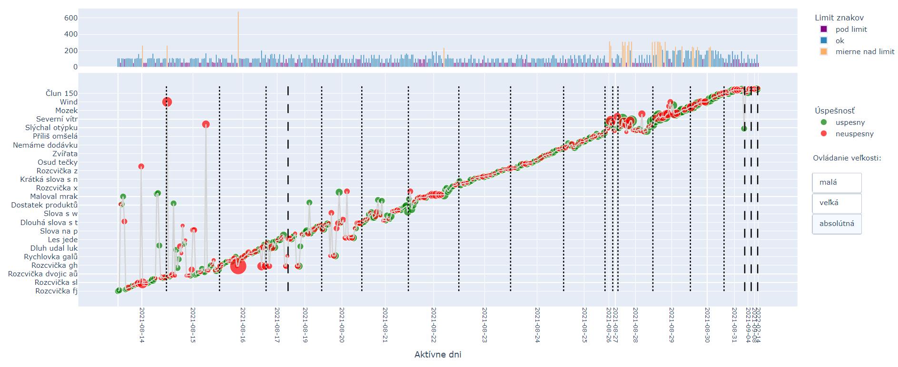
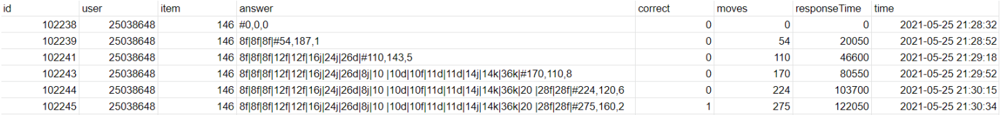

# Analysis and visualization of data from touch typing practice

This thesis is focused on the analysis and visualization of data from exercises for practicing writing with all ten fingers, which are part of the online educational website Umíme to.

This thesis consisted of 3 main parts:
1. Exploratory data analysis - found logs where users exploited bug in the website
2. Visualization of user activity in the system - main motivation was to create visualizations for system developers to gain better insight which exercises users practices, in which order and how hard they were to complete
3. Clustering users based on performance features and features sumarizing activity in system


### Created visualization
visualization of user activity:

this and other interactive visualizations are hosted on [github pages](https://cojeandy.github.io/bachelors-thesis/)


### Data description
I obtained 4 mil logs of touch typing exercises in csv format. Each log consisted of: 
``` 
1. id
2. user
3. item (exercise_id)
4. answer (wrongly typed characters and their index divided by |)
5. correct (indicator if exercise was completed)
6. responseTime (in miliseconds)
7. time 
```
example of set of logs for one completed exercise:



